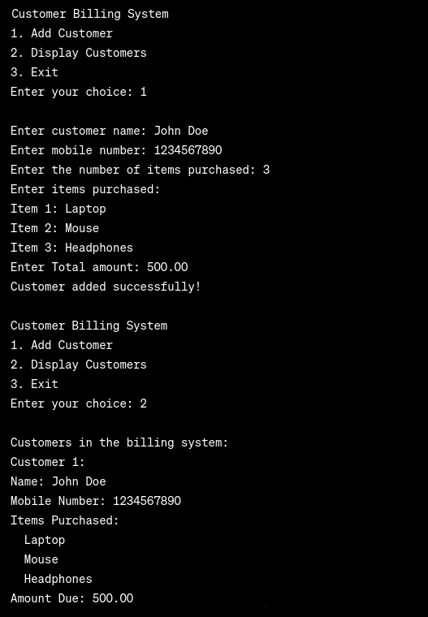

# Customer Billing System

This repository contains a simple Customer Billing System implemented in C. The system allows users to add customer information, display existing customer details, and exit the system. Customer data is stored persistently in a file (`billing.dat`), and an in-memory array is used to manage customer information during program execution.

## Features

- Add new customers with details such as name, mobile number, items purchased, and total amount.
- Display a list of all customers along with their details.
- Data persistence: Customer information is stored in the `billing.dat` file, allowing it to be retrieved across program executions.

## Usage

1. Clone the repository:

   ``bash
   git clone https://github.com/srijankarki07/Customer-Billing-System.git
   ``

2. Compile the program:

   ``bash
   gcc main.c -o customer_billing_system
   ``

3. Run the executable:

   ``bash
   ./customer_billing_system
   ``

4. Follow the on-screen menu to interact with the Customer Billing System.

## File Structure

- `main.c`: The main source code file containing the implementation of the Customer Billing System.
- `billing.dat`: File to store customer data persistently.

## Contributing

Contributions are welcome! Feel free to open issues or submit pull requests.

## License

This project is licensed under the MIT License - see the [LICENSE](LICENSE) file for details.

## Acknowledgments

- Inspiration or code snippets may have been taken from various sources, and credits are given where due.

Happy billing! 🚀

##Output
